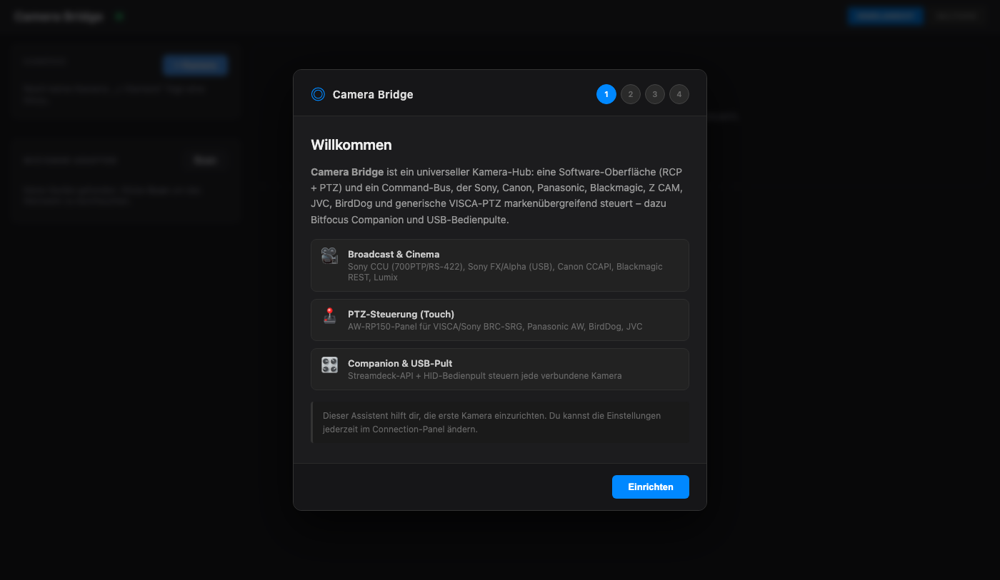

# LZ Camera Bridge

A universal camera-control hub. One software interface — a broadcast-style
**RCP** (paint controls) and a touch **PTZ panel** modelled on the Panasonic
AW‑RP150 — plus a normalizing **command bus** that drives cameras from many
vendors over their native protocols. The same commands also reach every camera
from a Bitfocus **Companion** surface or a USB **control panel**.



> **Name vs. repository slug.** The product is **LZ Camera Bridge**; the
> repository is still `larszu/sony-camera-bridge`, and that mismatch is
> deliberate (decided 2026-09-16), not an oversight someone forgot to clean up.
> Renaming a repository moves the Pages address and every clone URL, so it is
> a separate decision from renaming the product. Everything that *is* the
> product carries the new name — window title, installer, executable, app id,
> package names, Companion module id. Everything that is a **coordinate** —
> GitHub URLs, the Pages address, `BRIDGE_SOURCE.repo` in the multicam-planner
> — still says `sony-camera-bridge`, because that is where the files actually
> live. Do not "tidy" one side into the other: a coordinate that points
> nowhere is worse than an inconsistent name.

> **Status:** the bridge, protocols and UI are real and build clean; a
> committed unit-test suite covers the protocol framing. Where a family was
> verified against public docs or an official reference it is marked
> **verified** below. Items marked *tuning* need a first on-camera test to
> confirm value encodings. Nothing ships as a fake/demo device.

## Download

**One installation is the whole tool.** The installer for Windows and macOS
carries the control surface *and* the bridge; the bridge starts with the
application, on `ws://localhost:9700`, and stops with it.

**https://github.com/larszu/sony-camera-bridge/releases**

That was not always true, and the difference matters if you read an older note:
until 2026-09-16 the installer shipped the panel alone. It came up looking
complete and reconnected every three seconds against a bridge that nobody had
started — you were expected to run a second process out of a clone of this repo,
and nothing in the application said so. Now the panel finds its bridge because
the application brought it.

A separate bridge is still perfectly legal, and for a control room it is the
normal case: run the bridge where the cameras are and point tablets at it (see
*Other devices on the same network*). If port 9700 is already taken the
application says so and uses the bridge that is already running, instead of
failing silently.

## The web page

Every push to the default branch builds this repo's page from
`.github/workflows/pages.yml` and publishes it:

**https://larszu.github.io/sony-camera-bridge/**

The workflow **asks the Pages API before it configures anything.** With no
Pages site it still builds — that is a real check — and skips only the
publishing step, with a warning and the one missing step in the run summary.
A run that must stay red for a click nobody made teaches people to ignore red.

Measured 2026-09-16: **published.** The Pages site exists, and the `deploy` job
now runs through — the switch that no workflow can flip (`GITHUB_TOKEN` may not
create a site) has been thrown. Every push to `master` publishes by itself.

What the page carries is the README and `docs/`, rendered — **not the UI
itself.** That is deliberate and not an omission: `web-rcp` is a client that
needs the bridge, and on a Pages address it would look like the application
while operating no camera. The running program comes from the installer below.

---
## Supported cameras

| Family | Mode | Transport | Status |
|---|---|---|---|
| Sony CCU (HXC/HDC, BRC) | `tcp` / `serial` | 700PTP over TCP :7700 / RS‑422 | paint verified; AWB/ABB deliberately disabled¹ |
| Sony FX / Alpha (FX3, FX6, A7 …) | `sony-usb` | PTP vendor extension over USB (libusb) | **verified** (codes from libgphoto2) |
| Sony Monitor & Control (FX WiFi) | `sony-mnc` | HTTP :10000 + SSDP discovery | unverified (undocumented app protocol) |
| Canon EOS (R5/R6/R7/R8/R10 …) | `canon-ccapi` | CCAPI HTTP REST :8080 | **verified** (official CCAPI) |
| Panasonic Lumix (S1/S5/GH5/GH6 …) | `lumix-http` | `cam.cgi` HTTP | verified |
| Blackmagic (Pocket/Studio/URSA, FW 8.6+) | `blackmagic` | `/control/api/v1` REST + WS | **verified** |
| Z CAM (E2 family) | `zcam` | `/ctrl/set` HTTP | verified |
| Panasonic AW PTZ (AW‑UE/HE) | `panasonic-ptz` | `aw_ptz` / `aw_cam` CGI | **verified** (AW protocol) |
| VISCA over IP (PTZOptics, Marshall, AVer, Sony BRC/SRG) | `visca` | UDP :1259 (raw) / :52381 (Sony header) | **verified** |
| JVC ConnectedCam / KY‑PZ | `jvc` | Digest login + `/cgi-bin/api.cgi` | verified vocabulary (some steps *tuning*) |
| BirdDog NDI PTZ | `birddog` | VISCA :52381 + REST :8080 | verified endpoints (*tuning*) |
| VISCA on a serial line (same heads, RS‑232/422 wiring) | `visca-serial` | RS‑232 8N1, 9600 default, daisy‑chain address 1–7 | framing unit‑tested; *not yet on a camera* |
| DJI Ronin RS 2 / RS 3 Pro | `dji-ronin` | DJI R SDK over CAN 1 Mbit/s via USB SLCAN adapter | framing unit‑tested; *not yet on a gimbal*² |
| DJI Osmo Pocket 3 / 4 | `dji-osmo` | DUML over a serial (CDC) device | framing unit‑tested; *not yet on a gimbal*³ |

¹ Sony's 700 protocol is NDA-only; no public source documents the auto‑setup
command codes, so those buttons stay disabled rather than guessing at a
broadcast CCU. See `packages/web-rcp/src/capabilities.ts`.

² **RS 2 and RS 3 Pro only.** RS 3 and RSC 2 look the same and do not speak the
SDK. Needs a USB SLCAN adapter (CANable, USBtin, Lawicel) on the focus‑wheel
port — not SocketCAN, which is Linux‑only.

³ DJI publishes no control interface for the Pocket series, and its USB‑C port
serves storage and UVC webcam — **there is no USB control path.** The one
publicly reverse‑engineered route is Bluetooth LE; what ships here is DUML over
a serial device, and the BLE seam is prepared but not filled. Both gimbals move
the head only: a gimbal carries a camera, it is not one, so paint controls stay
greyed out. The full picture, including which constants to turn first if a
device stays silent, is in [`docs/dji-gimbal.md`](docs/dji-gimbal.md).

## Control surfaces

- **Web RCP** — Sony-style paint panel (iris, master black/gamma, R/G/B white &
  black balance, gain, ND, shutter, bars). Buttons are gated per backend so
  unsupported functions are disabled, not silently failing.
- **Touch PTZ panel** — AW‑RP150-style joystick (pan/tilt with speed),
  zoom/focus rockers, push‑AF, iris and a paged preset grid with a store mode.
- **Bitfocus Companion** — HTTP + WebSocket module; Streamdeck actions route to
  whichever camera is connected.
- **USB HID control panel** — a data-driven adapter maps a hardware panel's
  axes/buttons onto the command bus, so one panel controls any brand.

## Architecture

```
Input surfaces                 Bridge (command bus)              Camera backends
────────────────               ────────────────────              ───────────────
Web RCP  ─┐                                                      ┌─ Sony CCU (700PTP)
PTZ panel ┼─ WebSocket :9700 ─▶  BridgeServer                    ├─ Sony USB (PTP)
Companion ┼─ HTTP/WS :9701-2 ─▶   dispatchCameraCommand ─(RCP)──▶├─ Canon CCAPI
HID panel ─┘                      + per-mode connect/state       ├─ Lumix / Z CAM / Canon
                                                                 ├─ Blackmagic REST
                                                                 ├─ VISCA (raw / Sony)
                                                                 └─ Panasonic/JVC/BirdDog PTZ
```

Every backend exposes the same `handleRcpCommand(cmd, params)` contract, so a
single command vocabulary (`setIris`, `setMasterGain`, `ptz`, `recallPreset`, …)
fans out to all of them. A visual walk-through lives in
[`docs/architecture.html`](docs/architecture.html).

Paint values can be trimmed relatively (`cmd: 'nudge'`) instead of only jumped
to: one resolution for every path — WebSocket, Companion buttons, the RCP's
up/down selectors — against the value the bridge has actually read. Where it has
read none, the trim is refused with a reason rather than started from a guessed
128. The bus scale of every value, and what each backend makes of it, is
documented in [`docs/paint-nudge.md`](docs/paint-nudge.md).

Every paint value on the panel says where it comes from: read back from the
device, or merely the last thing the bridge sent. Which is which is decided per
field and per connection mode by a table that was read out of this repository's
own backends — five of the twelve paths read nothing back at all, and the panel
says so once at the top instead of marking twenty knobs. See
[`docs/value-origin.md`](docs/value-origin.md).

Live-video feasibility per camera family — which cameras can show a live
picture in the panel, at what cost — is documented in
[`docs/live-video.md`](docs/live-video.md).

The bridge reads the `camera-list` the AV Planner Suite's MultiCam Planner
exports and holds it against the cameras on the bus, so the control wall can
label a slot the way the show calls it ("CAM 3 — Bühne links") instead of by
number. Every match carries evidence — a measured model, a mere convention, or a
human — and where there is none, there is no match. See
[`docs/camera-plan.md`](docs/camera-plan.md).

## Packages

| Path | What it is |
|---|---|
| `packages/bridge` | Node/TypeScript bridge server, camera clients, protocols, HID input |
| `packages/web-rcp` | React UI (RCP + PTZ panel, connection wizard) |
| `packages/companion-module-lz-camera-bridge` | Bitfocus Companion module |
| `packages/electron-app` | Desktop application: the web UI **and** the bridge, bundled into one installer |
| `packages/firmware` | WIZ108SR serial↔TCP bridge firmware (C) |

**Source language:** `en`. New user-facing text goes in English. That is not a
preference but a measurement: the UI already carries roughly 140 English spots
against 32 German ones, and its vocabulary is the technical one anyway — Iris,
Gain, ND, Paint. Rewriting the English into German to then put „Blende" next to
`WB` costs work and makes the result worse. Decided 2026-09-08 (E-17);
`multicam-planner` is English-source as well, while `cable-planner` and
`light-planner` are German-source. The machine-readable copy of this
declaration sits in `package.json` under `avplan.sourceLanguage`.

The German spots that are still there are a **mixed-language product**, not a
translation backlog — the same dialog shows both. `npm run lang:check` counts
them and holds the count at the level measured when the check was introduced:
while that cleanup is open, the existing ones may stay, but the mix must not
grow. Translating some means lowering the limit in the same commit.

## Getting started

```bash
npm install            # workspaces install
./dev.sh               # Linux / macOS — bridge + web UI, demo camera preselected
npm run dev            # the same via npm (bridge backgrounded with `&`)
npm test               # protocol framing unit tests
```

### Try it without a camera

Pick the **Demo (no camera)** tab in the connection panel and connect. The
panel then talks to a state held in the bridge: move a control and the value
follows, so the surface — RCP, joystick, layout — can be tried on a laptop.

Before this, `npm run dev` always started but could not *show* anything:
every backend in `backendFactory` needs a real address (a CCU on TCP, a VISCA
port, a USB device in PC-Remote mode). Without one the panel came up empty
and every control was inert.

**It is not a camera simulator.** Nothing drifts, nothing is measured, and
every value moved because a command moved it. The state carries an `isDemo`
flag all the way to the dashboard, so a demo value can never be mistaken for
a reading from a real device — that is the same line `valueOrigin.ts` draws
between *commanded* and *confirmed*, and `test/demoKamera.test.ts` holds it:
one case asserts that nothing changes over 600 ms with no command, another
that `isDemo` survives `mapState`.

`dev.sh` also cleans up after itself. `npm run dev` appends the bridge with
`&` and leaves it: a Ctrl-C ends only the web UI, the bridge stays on port
9700, and the next start fails on it.

### Other devices on the same network

The bridge binds every interface and now prints the addresses you can hand
out, not just `localhost`:

```
[BridgeServer] WebSocket listening on ws://localhost:9700
[BridgeServer]                     ws://192.168.1.42:9700  (same network)
```

All detected addresses are listed rather than one being guessed: on a machine
with a Docker or VPN bridge the first one is often the wrong one.

Build individually:

```bash
npm run build --workspace=packages/bridge
npm run build --workspace=packages/web-rcp
```

Optional native modules (loaded lazily, not required to build/run):

```bash
npm install usb      --workspace=packages/bridge   # Sony USB (PTP) discovery/control
npm install node-hid --workspace=packages/bridge   # USB control-panel input
```

## First run

Open the web UI and follow the setup wizard: pick a camera family, enter its
address (the wizard shows the right defaults per protocol), and connect. PTZ
cameras open the joystick panel automatically; paint cameras open the RCP.

- **Sony BRC/SRG PTZ:** choose the *VISCA over IP* tab and set port **52381** —
  the Sony transport header is applied automatically.
- **Sony FX/Alpha USB:** put the camera in *PC Remote* mode; install the `usb`
  module on the host.
- **Canon:** activate CCAPI once via Canon's tool, then enter the shown IP/port.
- **VISCA on a cable:** the *VISCA RS‑232* tab. Most heads ship at 9600 baud,
  address 1. Not the same as the *8‑Pin RS‑422* tab next to it — that is Sony's
  9‑pin protocol on a different cable with different framing (odd parity).
- **DJI gimbals:** the *DJI Ronin* and *DJI Osmo Pocket* tabs move the head
  only. Read [`docs/dji-gimbal.md`](docs/dji-gimbal.md) first — it says what is
  proven and what is not, and there is no USB control path for the Pocket.

## License

Proprietär — © 2026 Lars Zumpe, alle Rechte vorbehalten. Nutzung der veröffentlichten Builds ist kostenlos; Weiterverbreitung und abgeleitete Werke sind es nicht. Siehe [LICENSE](LICENSE).
